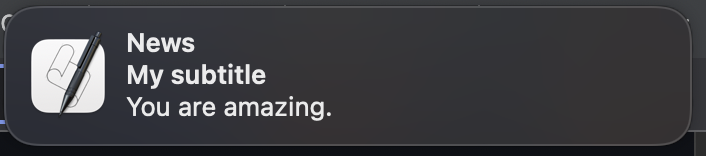

# go-mac-notifier

Send desktop notifications to OSX 10.9 or higher.



## Install

```bash
$ go get github.com/wobsoriano/go-mac-notifier
```

## Usage

```go
package main

import (
  "log"

  "github.com/wobsoriano/go-mac-notifier"
)

func main() {
  options := notifierOptions{
    title: "News",
    text: "You are amazing.",
    subtitle: "My subtitle",
    sound: "Hero", // Check ~/Library/Sounds or /System/Library/Sounds for available sounds
  }

  err := notifier.DisplayNotification(options)
}
```

## License

MIT
